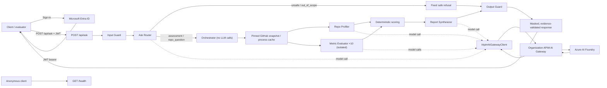

# Mimari genel bakış

| Bileşen | Klasör | Sorumlu issue |
|---|---|---|
| Solution ve CI/GHAS iskeleti | `src/`, `.github/workflows/` | P01 |
| Specs, README, mimari, ADR ve şablonlar | `docs/`, `.github/` | P02 |
| API, config, rate limit ve health | `src/Hackathon.Assessment.Api/Endpoints`, `Options`, `Health` | P03 |
| Snapshot ve repo erişimi | `Snapshot/` | P04 |
| Read-only tools, bulgu kaydı ve scannerlar | `Tools/`, `Scanners/` | P05 |
| APIM client ve telemetry | `Ai/`, `Telemetry/` | P06 |
| Evaluator, metrikler ve sonuç cache'i | `Agents/`, `Caching/` | P07 |
| Orkestrasyon, puanlama ve raporlama | `Orchestration/`, `Scoring/`, `Reporting/` | P08 |
| Masking ve AURA safety guard'ları | `Masking/`, `Safety/` | P09 |
| Entra kimlik doğrulama ve AURA bağlantısı | `Auth/` | P10 |
| CI/CD ve deploy | `.github/workflows/`, `infra/` | P11 |
| Sistem entegrasyonu ve operasyon kanıtı | `tests/`, `docs/` | P12 |

Tüm model trafiği `IApimAiGatewayClient` üzerinden ortak APIM AI Gateway'e gider;
`Apim:RouteStyle` `AzureDeployments` deployment URL'si veya OpenAI v1 route'unu
seçer. Foundry'ye doğrudan trafik yasaktır. `GET /health` anonimdir ve AI/APIM
çağrısı yapmaz. Ayrıntılar: [spec dizini](spec/README.md),
[solution yapısı](spec/03-solution-yapisi.md), [runtime zinciri](spec/02-runtime-zinciri.md),
[API sözleşmesi](spec/11-api-sozlesmesi.md), [ADR'ler](adr/README.md).
