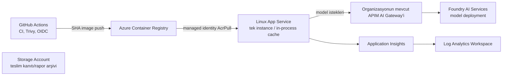

# Azure mimarisi (portalda elle kurulum)

Bu dağıtım Azure kaynaklarını **oluşturmaz**. Ekip Azure Portal'da kaynakları
hazırlar ve erişimleri doğrular; CI/CD yalnız önceden kurulmuş ACR'a image
gönderir ve önceden kurulmuş App Service'in image'ını günceller. Bölge, SKU,
isim, model sürümü, kota ve gerçek kimlik değerleri organizasyondan alınır;
bu repository'de hazır örnek değer varsayılmaz. Bicep/Terraform/`what-if` yoktur.

## Portal kurulum kontrol listesi

1. Organizasyonun verdiği resource group, bölge ve team/application/environment
   etiketleriyle bir **Log Analytics Workspace** oluşturun. Aynı workspace'e
   bağlı **Application Insights** oluşturun. Connection string'i yalnız App
   Service Configuration'da saklayın; request/dependency/token metriklerini
   içeriksiz toplayın.
2. **Storage Account** (StorageV2) oluşturun: public blob access kapalı,
   HTTPS only, minimum TLS 1.2. Uygulama kalıcı veri yazmaz; bu kaynak yalnız
   teslim kanıtı/rapor arşivine ayrılmıştır. Uygulamaya Storage credential
   verilmez.
3. **ACR** oluşturun, admin user'ı kapatın. CD için OIDC kimliğine yalnız
   gerekli ACR push yetkisi tanıyın. ACR login server ve adını teyit edin.
4. Organizasyonun onayladığı SKU'da **Linux App Service Plan** ve bu planda
   **tek** container **App Service** oluşturun. HTTPS only, TLS en az 1.2,
   FTPS disabled, Always On, health check `/health`, `WEBSITES_PORT=8080`,
   instance/worker sayısı **1**, autoscale kapalı olmalı. Container image
   kaynağı ACR'dır. App Service system-assigned managed identity'sini etkinleştirin,
   bu principal'a registry kapsamında **AcrPull** verin ve App Service
   container registry erişiminde managed identity credential kullanımını
   (`acrUseManagedIdentityCreds`) etkinleştirin. CD OIDC kimliğine bu App
   Service'in container image ve app settings'ini güncelleme yetkisi verin.
5. Organizasyonun sağladığı ad/kota/sürüm/SKU ile **Foundry AI Services**
   resource/project ve model deployment'ını kurun; uygulamayı **doğrudan
   Foundry'ye bağlamayın**. Kurumun ortak APIM AI Gateway endpoint'i ve
   auth yöntemi ayrı önkoşuldur; bu PR APIM'i oluşturmaz.
6. `docs/operations.md` tablosundaki App Settings'i portalda tamamlayın.
   Production'da `<ORGANİZASYONDAN-ALINACAK>` placeholder'ları kalmamalı;
   zorunlu config eksikse API bilinçli olarak açılmaz. App Service'i tek
   instance bırakın: process içi snapshot/metrik cache'i instance'lar arasında
   paylaşılmaz, aynı sonuç yalnız o instance ve TTL içinde tekrarlanabilir.
7. Deployment'dan önce ACR push, App Service config ve OIDC yetkilerini
   portalda doğrulayın. Production environment onayı olmadan CD başlamaz.

Key Vault, DB, queue, ikinci App Service veya ayrı cache bu işin parçası
değildir. Secret'lar repository'ye veya image katmanına değil, portal App
Service secret settings'ine girilir; ileride kurumsal Key Vault tercih
edilirse ayrı güvenlik çalışması gerekir.
