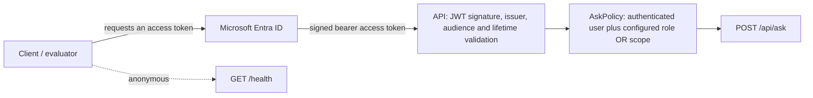

# Entra ID single sign-on

The API validates Entra ID access tokens in code with JWT bearer authentication. App Service Authentication (Easy Auth) is not used; configure the App Service without a second authentication layer. The user's access token is never forwarded to the APIM AI Gateway, whose caller authentication remains a separate organization-owned configuration.



## App registration

1. Register the API with the organization-provided tenant and expose an API.
2. Set the Application ID URI to `<ORGANİZASYONDAN-ALINACAK>`.
3. Define the app role and/or delegated scope required by the organization. Names are organization-owned; do not assume a role or scope name.
4. Register evaluator and AURA clients as directed by the organization, grant the required API permissions, and obtain consent where required.
5. Configure the API with the corresponding tenant and audience. Leave required roles and scopes empty for the authenticated-user baseline, or set the organization-approved values. When either list is non-empty, a caller must have at least one configured role **or** one configured scope.

## API configuration

Set these App Settings keys (or their equivalent environment variables). Tenant, audience, role, and scope values are supplied by the organization; no real tenant or application identifiers belong in this repository.

| App Setting | Environment variable | Value |
|---|---|---|
| `EntraId:Instance` | `EntraId__Instance` | `https://login.microsoftonline.com/` |
| `EntraId:TenantId` | `EntraId__TenantId` | `<ORGANİZASYONDAN-ALINACAK>` |
| `EntraId:Audience` | `EntraId__Audience` | `<ORGANİZASYONDAN-ALINACAK>` |
| `EntraId:RequiredRoles:0` | `EntraId__RequiredRoles__0` | Empty for baseline; otherwise `<ORGANİZASYONDAN-ALINACAK>` |
| `EntraId:RequiredScopes:0` | `EntraId__RequiredScopes__0` | Empty for baseline; otherwise `<ORGANİZASYONDAN-ALINACAK>` |

Placeholders are accepted in Development and Testing. Production startup fails with the names of unconfigured keys, never their values. The App Service Easy Auth feature must not also enforce authentication.

## Obtaining an access token

The organization will determine how evaluators and AURA obtain tokens. If the organization selects the client-credentials flow, use its approved client registration and secret store; the following is a placeholder-only example:

```sh
curl --request POST \
  --url 'https://login.microsoftonline.com/<tenant>/oauth2/v2.0/token' \
  --header 'Content-Type: application/x-www-form-urlencoded' \
  --data-urlencode 'client_id=<client-id>' \
  --data-urlencode 'client_secret=<client-secret>' \
  --data-urlencode 'grant_type=client_credentials' \
  --data-urlencode 'scope=<Audience>/.default'
```

For local development, a signed-in developer can request a token with:

```sh
az account get-access-token --resource <Audience>
```

The developer account and API permissions must be authorized by the organization.

Example request (replace placeholders locally; never commit a real token):

```sh
curl --request POST \
  --url 'https://<api-host>/api/ask' \
  --header 'Authorization: Bearer <access-token>' \
  --header 'Content-Type: application/json' \
  --data '{"question":"<question>"}'
```

## HTTP error behavior

| Status | Meaning | Response |
|---|---|---|
| 401 Unauthorized | Missing, malformed, expired, or otherwise invalid bearer token | ProblemDetails with `correlationId` and `WWW-Authenticate: Bearer`; no token or validation details |
| 403 Forbidden | Valid authenticated token without any configured required role or scope | ProblemDetails with `correlationId`; no stack trace or claim details |

Both responses occur before request validation, orchestration, repository snapshot work, or APIM calls. `/health` is anonymous and returns 200 without a bearer token.

## Automated and live verification

Run the network-free authentication and integration tests:

```sh
dotnet test --filter "FullyQualifiedName~Auth|FullyQualifiedName~Integration"
```

The tests use an ephemeral RSA key and a static in-memory OpenID Connect configuration; they do not contact a real tenant or fetch OIDC metadata. They cover token absence, issuer/audience/signature/lifetime failures, malformed bearer values, role and scope authorization, the authenticated baseline, v1 issuer/audience aliases, `/health`, response safety, and downstream isolation.

Live evidence remains pending until the organization supplies the tenant, API registration, audience, role/scope, evaluator and AURA token-acquisition method, and a deployed environment. Once available, record:

- A real authorized Entra token receives 200 from `POST /api/ask`.
- A request without a token receives 401.
- A valid token without a configured required role/scope receives 403 (when the organization configures one).
- Authentication failures do not invoke the orchestrator or APIM.
